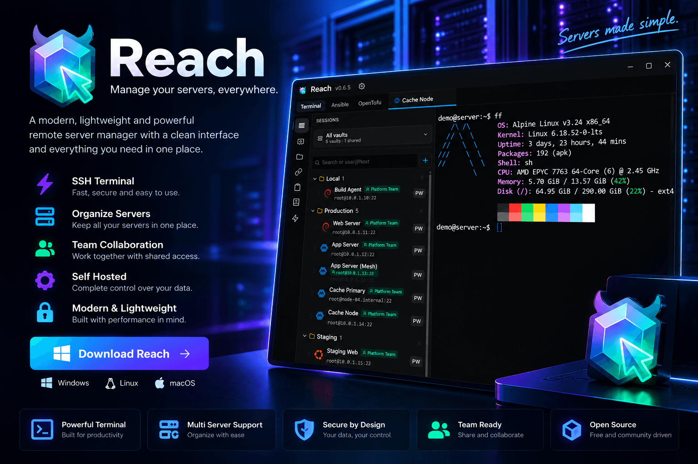

<p align="center">
  
</p>

<h1 align="center">Reach</h1>

<p align="center">
  A modern, cross-platform SSH client and remote management tool.<br>
  Built for engineers who got tired of PuTTY and wanted something that just works.
</p>

<p align="center">
  
  
  
  <a href="https://discord.gg/CSbEybvDVV"></a>
  <a href="https://github.com/sponsors/alexandrosnt"></a>
</p>

<p align="center">
  <a href="https://reachssh.com/"><strong>Documentation</strong></a> · <a href="https://github.com/alexandrosnt/Reach/releases">Download</a> · <a href="https://discord.gg/CSbEybvDVV">Discord</a> · <a href="https://github.com/alexandrosnt/Reach/issues">Report a Bug</a>
</p>

---

<p align="center">
  <a href="https://reachssh.com/download/">
    
  </a>
</p>

---

## Why Reach?

Most SSH tools feel like they were designed in 2005, because they were. MobaXterm is Windows-only and bloated, PuTTY hasn't changed in decades, and Termius wants a subscription for basic features.

Reach is what happens when you build an SSH client from scratch with a native UI, proper encryption, and the kind of workflow you'd actually want to use every day. No Electron. No subscription. Just a fast, clean tool that runs everywhere.

## What's inside

### Core

- **SSH Terminal** · Full interactive shell with WebGL rendering. Tabs, split views, and resize that actually works.
- **SFTP File Explorer** · Browse remote filesystems, drag-and-drop transfers, inline editing. Feels like a local file manager.
- **Compress and extract in place** · Right-click to make a `.tar.gz`, `.zip` and the rest, or unpack one, with the work done on the remote machine. Falls back through whatever archiver it actually has, so it still works on a stripped container.
- **Drag a file out to your desktop** · On Windows nothing is downloaded until you drop it, and the bytes land where you dropped them.
- **Session Manager** · Save connections with folders and tags. Credentials are encrypted at rest, not stored in plaintext configs.
- **Jump Host (ProxyJump)** · Connect through bastion servers with multi-hop SSH tunneling. Import hosts directly from `~/.ssh/config`.

### Productivity

- **Port Tunneling** · Local, remote, and dynamic SOCKS forwarding. Set it up once, save it with the session.
- **Snippets** · Save the commands you keep retyping and complete them with Tab. Prefix-matched, so a hundred of them feel like three.
- **System Monitoring** · Live CPU, memory, and disk stats from connected hosts without installing agents.

### Infrastructure as Code

- **Ansible** · Run one command across a whole inventory, or a full playbook. Manage playbooks, inventories, roles, and collections. Run playbooks and ad-hoc commands with streaming output. Encrypts/decrypts files with ansible-vault. On Windows, automatically runs through WSL.
- **OpenTofu** · Plan, apply, and destroy infrastructure. Browse state, manage providers and modules. Full workspace with file editor and streaming command output.

### Working with others — people and AI

- **Session Sharing** · Your terminal and someone else's side by side, peer to peer over WebRTC with no server in between, encrypted end to end on top of DTLS. Each side decides whether the other may only watch or also type, enforced on the machine that owns the terminal. Off by default — and off means the code is never loaded.
- **MCP Server** · Hand a session you choose to Claude Code, Cursor, Gemini CLI or any MCP client. Loopback only, off by default. A guard enforces the rules: read before write, no typing while you enter a password, no secrets in either direction. Pick an agent that decides which tools the AI gets, and a mode that decides how much you are asked.
- **Recipes** · Reusable bash scripts with parameters and a declared risk level, run against the terminal you have open. Every script is analysed before it runs and anything above *mutating* needs a typed confirmation. Share them through a [registry](https://github.com/alexandrosnt/reach-recipes-registry) where each one is pinned by SHA-256.

### Extras

- **Serial Console** · Talk to routers, switches, and embedded devices over COM/TTY.
- **Remote Desktop (RDP)** · A Windows desktop in a tab, on every platform Reach runs on. Clipboard and files go both ways, a local folder can be shared in as a drive, and the server's certificate goes through the same trust-on-first-use prompt as an SSH host key.
- **AI Assistant** · Optional AI integration for command suggestions and troubleshooting (bring your own API key).
- **Host Key Verification** · Trust on first use, and a loud stop when a known key changes. Never accepts one silently, and refuses rather than connecting if it cannot ask.
- **Themes** · Colour tokens the whole app reads, not just the terminal. Install more from a registry, pinned by SHA-256.
- **Encrypted Vault** · Store secrets, credentials, and SSH keys in an encrypted vault with cloud sync support.
- **Lua Plugins** · Extend Reach with sandboxed Lua scripts. Access SSH, storage, and UI hooks through the host API.
- **Auto-Updates** · The app checks for updates on startup and periodically while running. No manual downloads.
- **Nine languages** · English, German, Spanish, French, Italian, Greek, Bulgarian, Russian and Chinese. Translations are plain JSON under `src/lib/i18n/locales`, and a missing key fails CI rather than shipping.

## Tech

Reach is a [Tauri v2](https://v2.tauri.app) app with a Rust backend and Svelte 5 frontend. The entire SSH stack runs natively in Rust through [russh](https://github.com/warp-tech/russh), with no OpenSSH dependency. The UI is rendered in a system webview (not bundled Chromium), so the final binary is small and memory usage stays low.

| | |
|---|---|
| **Backend** | Rust, Tokio, russh |
| **Frontend** | Svelte 5, SvelteKit, TypeScript |
| **Styling** | Tailwind CSS v4 |
| **Terminal** | xterm.js with WebGL addon |
| **Crypto** | XChaCha20-Poly1305, Argon2id, X25519 |
| **Platforms** | Windows, macOS, Linux, Android |

## Getting started

Head to the [download page](https://reachssh.com/download/), which always points at the current release: Windows (`.exe`, `.msi`), macOS (`.dmg`, Apple silicon and Intel), Linux (`.AppImage`, `.deb`, `.rpm`) and Android (`.apk`). Every build is on the [Releases page](https://github.com/alexandrosnt/Reach/releases) too, and Reach updates itself once installed.

## Building from source

You'll need [Rust](https://rustup.rs), [Node.js 22+](https://nodejs.org), and the [Tauri prerequisites](https://v2.tauri.app/start/prerequisites/) for your OS.

```bash
git clone https://github.com/alexandrosnt/Reach.git
cd Reach
npm install
npm run tauri dev
```

For a production build:

```bash
npm run tauri build
```

## Changelog

See [CHANGELOG.md](CHANGELOG.md) for the full release history.

## Community

Reach has a Discord: **[discord.gg/CSbEybvDVV](https://discord.gg/CSbEybvDVV)**. Releases and repository activity post there automatically, so it is the quickest way to hear about a new build or a fix that landed. Bring questions, bug reports you are not sure are bugs yet, and the recipe you wrote that others might want.

## Support the project

Reach is free, MIT licensed, and stays that way. It is built on no budget at all, in spare time — which is why the installers are not code-signed yet and every platform is tested on whatever machine can be borrowed. Sponsorship is what would change that: a signing certificate so installers stop getting flagged, a server to build and test on, and time that goes into Reach instead of around it.

If Reach saves you time, you can support it through **[GitHub Sponsors](https://github.com/sponsors/alexandrosnt)** — the **Sponsor** button at the top of this page, or **Settings → General → Support Reach** inside the app. One-off or monthly, whatever fits. Nothing is gated behind it and nothing ever will be; it just decides how much of the evenings go to Reach.

Not in a position to give money? A bug report with a reproduction, a translation, a recipe in the registry, or telling a colleague are all worth as much.

## Contributors

<a href="https://github.com/alexandrosnt/Reach/graphs/contributors">
  
</a>

Generated from the repository, so it is right without anyone remembering to
update it. Names link through to what each person actually changed.

## Contributing

Contributions are welcome. Bug reports, feature ideas, and pull requests all help. If you're picking up a larger feature, open an issue first so we can talk about the approach.

## License
### Licensed under the MIT License.
This project is free software: you are allowed to use, modify, and redistribute it for personal, academic, or commercial purposes under the terms of the MIT license. See the [LICENSE](LICENSE) file for full details.
