<p align="center">
  
</p>

<h1 align="center">Reach</h1>

<p align="center">
  A modern, cross-platform SSH client and remote management tool.<br>
  Built for engineers who got tired of PuTTY and wanted something that just works.
</p>

<p align="center">
  
  
  
</p>

---

<p align="center">
  
</p>

---

## Why Reach?

Most SSH tools feel like they were designed in 2005, because they were. MobaXterm is Windows-only and bloated, PuTTY hasn't changed in decades, and Termius wants a subscription for basic features.

Reach is what happens when you build an SSH client from scratch with a native UI, proper encryption, and the kind of workflow you'd actually want to use every day. No Electron. No monthly fee. Just a fast, clean tool that runs everywhere.

## What's inside

### Core

- **SSH Terminal** · Full interactive shell with WebGL rendering. Tabs, split views, and resize that actually works.
- **SFTP File Explorer** · Browse remote filesystems, drag-and-drop transfers, inline editing. Feels like a local file manager.
- **Session Manager** · Save connections with folders and tags. Credentials are encrypted at rest, not stored in plaintext configs.

### Productivity

- **Playbooks** · Write YAML scripts to automate deployments and maintenance across multiple servers. Think Ansible-lite, built in.
- **Port Tunneling** · Local, remote, and dynamic SOCKS forwarding. Set it up once, save it with the session.
- **Multi-Exec** · Broadcast the same command to 10 servers at once. Handy for fleet updates.
- **System Monitoring** · Live CPU, memory, and disk stats from connected hosts without installing agents.

### Extras

- **Serial Console** · Talk to routers, switches, and embedded devices over COM/TTY.
- **AI Assistant** · Optional AI integration for command suggestions and troubleshooting (bring your own API key).
- **Encrypted Vault** · Store secrets, credentials, and SSH keys in an encrypted vault with cloud sync support.
- **Auto-Updates** · The app checks for updates on startup and periodically while running. No manual downloads.

## Tech

Reach is a [Tauri v2](https://v2.tauri.app) app with a Rust backend and Svelte 5 frontend. The entire SSH stack runs natively in Rust through [russh](https://github.com/warp-tech/russh), with no OpenSSH dependency. The UI is rendered in a system webview (not bundled Chromium), so the final binary is small and memory usage stays low.

| | |
|---|---|
| **Backend** | Rust, Tokio, russh |
| **Frontend** | Svelte 5, SvelteKit, TypeScript |
| **Styling** | Tailwind CSS v4 |
| **Terminal** | xterm.js with WebGL addon |
| **Crypto** | XChaCha20-Poly1305, Argon2id, X25519 |
| **Platforms** | Windows, macOS, Linux, Android |

## Getting started

Grab the latest release from the [Releases page](https://github.com/alexandrosnt/Reach/releases). Installers are available for Windows (NSIS), macOS (.dmg), Linux (.deb, .AppImage, .rpm), and Android (.apk).

## Building from source

You'll need [Rust](https://rustup.rs), [Node.js 22+](https://nodejs.org), and the [Tauri prerequisites](https://v2.tauri.app/start/prerequisites/) for your OS.

```bash
git clone https://github.com/alexandrosnt/Reach.git
cd Reach
npm install
npm run tauri dev
```

For a production build:

```bash
npm run tauri build
```

## Project structure

```mermaid
graph LR
  root["🗂 Reach"]

  root --> src["📁 src · Svelte frontend"]
  root --> tauri["📁 src-tauri · Rust backend"]
  root --> gh["📁 .github/workflows · CI/CD"]

  src --> routes["📄 routes"]
  src --> lib["📁 lib"]

  lib --> components["📁 components"]
  lib --> state["📄 state · Reactive .svelte.ts modules"]
  lib --> ipc["📄 ipc · Tauri command wrappers"]
  lib --> i18n["📄 i18n · Internationalization"]

  components --> layout["📄 layout · AppShell, TitleBar, Sidebar"]
  components --> terminal["📄 terminal · SSH terminal, multi-exec"]
  components --> explorer["📄 explorer · SFTP file browser"]
  components --> sessions["📄 sessions · Connection manager"]
  components --> tunnel["📄 tunnel · Port forwarding UI"]
  components --> playbook["📄 playbook · Editor and runner"]
  components --> vault["📄 vault · Encrypted secrets"]
  components --> ai["📄 ai · AI assistant panel"]
  components --> settings["📄 settings · App preferences"]
  components --> shared["📄 shared · Button, Modal, Toast"]

  tauri --> taurisrc["📁 src"]
  taurisrc --> ssh["📄 ssh · SSH client via russh"]
  taurisrc --> sftp["📄 sftp · File transfers"]
  taurisrc --> tvault["📄 vault · Encrypted storage, crypto"]
  taurisrc --> ttunnel["📄 tunnel · Port forwarding engine"]
  taurisrc --> pty["📄 pty · Local terminal (desktop)"]
  taurisrc --> serial["📄 serial · Serial port (desktop)"]
  taurisrc --> monitoring["📄 monitoring · Remote system stats"]
  taurisrc --> tplaybook["📄 playbook · Execution engine"]
  taurisrc --> tipc["📄 ipc · Tauri command handlers"]
```



## Contributing

Contributions are welcome. Bug reports, feature ideas, and pull requests all help. If you're picking up a larger feature, open an issue first so we can talk about the approach.

## License

Source-available. You can view the code, use it personally, and contribute back. Commercial use and redistribution require permission. See [LICENSE](LICENSE) for the full terms.
